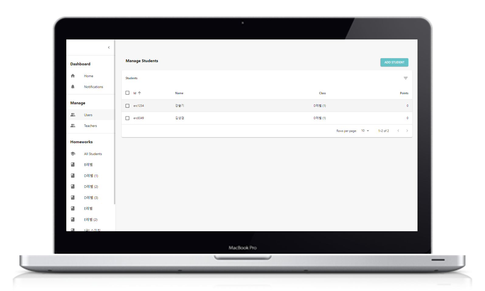
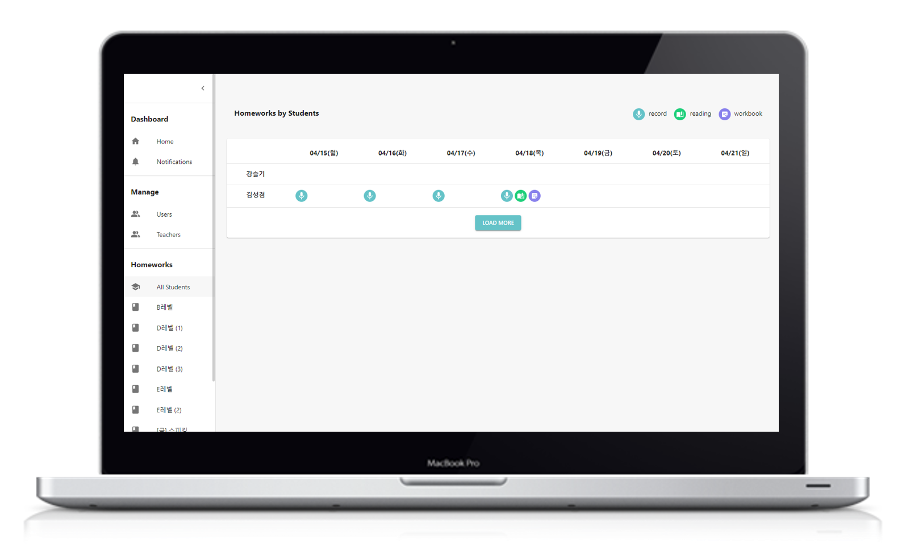

# ERC Homework App: 숙제 제출 &amp; 관리 앱

ERC(English Reading Club) 라는 브랜드의 숙제 관리앱을 제작 하였습니다.

> 프로젝트 주제 : 숙제 제출과 관리를 도와주는 PWA(Progressive Web Application)  
> 프로젝트 기간 : 03월 08일(금) ~ 04월 28일(일)  
> 주요 목표 : UI/UX 작업, React.js 기반 컴포넌트 단위 구조 설계, MediaStream Recording API을 활용한 녹음 기능, 네이버 책 검색 api 활용한 독서후기 제출 기능개발

<br />

## 💡 기존 숙제 관리의 문제

**선생님 Pain point**

- 기존에는 밴드 혹은 카톡으로 학생, 보호자에게 숙제를 받아서 노션이나 구글 드라이브 같은곳에 일일이 수작업으로 정리 해야 하는 문제가 있었습니다.
- 숙제의 제출과 검사 과정을 간단히 해서 문제를 해결할 필요가 있었습니다.

**학생 Pain point**

- 제출할 숙제 양이 많고, 제출 방법이 다양해서 복잡한 측면이 있었습니다.
- 전달사항이 다양한 채널을 통해 전달되어서 복잡했습니다.

<br />

## 주요 구현 사항

**🎯 학생 화면**

- pc/mobile 환경을 모두 지원하기 위해 React를 사용한 PWA로 제작
- MediaStream Recording API(WebRTC)을 활용한 녹음 기능 개발
- 네이버 책 검색 api를 사용한 독서후기 업로드 기능 개발
- 내 숙제 현황 확인을 위함 홈 화면 개발

|                  홈 화면                   |                    녹음숙제 화면                    |
| :----------------------------------------: | :-------------------------------------------------: |
|  |  |

|                    북리딩숙제 화면                     |                     워크북숙제 화면                     |
| :----------------------------------------------------: | :-----------------------------------------------------: |
|  |  |

<br />

**📖 선생님 화면**

- 학생 관리 페이지
- 선생님 관리 페이지
- 클래스별 숙제 관리 페이지
- 전체 숙제 확인 페이지
- 숙제 알림 페이지

**선생님 - 메인 화면**

**선생님 - 학생 관리 화면**

**선생님 - 전체 숙제 확인 화면**

**선생님 - 클래스별 숙제 확인 화면**


## 📊 문제 해결

### 검사 시간 단축

- 기존 방식은 매 수업전 쉬는시간 10분가량 검사 --> 선생님 페이지에서 수업 시작전 클래스별 숙제 한번에 확인 가능하여 **숙제 검사 시간 약30% 절약**
- 쉬는 쉬간 외에 검사가 가능해져 수업 준비 시간확보
- **숙제 정리**를 위해 사용했던 하루 평균 **1~2시간**의 시간을 **5~10분**정도의 시간으로 줄임.

<br />

### 🔑 테스트 아이디, 비밀번호

> id : erc8349  
> pw : erc8349!

<br />

### 📌 환경설정

dev mode

```bash
git clone https://github.com/skyeome/erc-homework-app.git
npm install
npm run dev
```

.env

```
NAVER_BASE_URL=네이버 책 검색요청을 보낼 api 주소
NAVER_CLIENT_ID=네이버 책 검색 api client id
NAVER_CLIENT_SECRET=네이버 책 검색 client secret
VAPID_KEY=알림 기능 구현을 위한 vapid key(선택)
```
